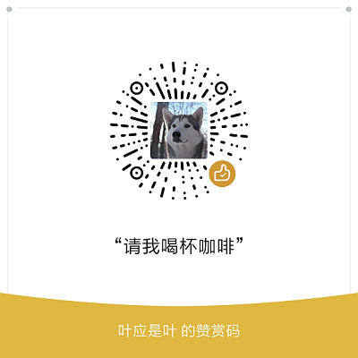

# Round
> 以下内容于 2019/08/09 修改

一个简简单单的 IM 应用

这是一个简单的IM应用，写这个应用的本意只是想练练手，暂且实现了私聊和群聊功能，后边再根据用户反馈情况再来更新吧~应用完全开源，觉得还不错的同学不如点击应用内的“赞赏支持”来赞助我喝杯咖啡？

### 下载地址：[Round](https://www.pgyer.com/Round)

  
 
 

### 账号

由于后台限制，目前只允许注册一百个账号，如果你发现注册不了，可以使用以下我预先注册好的几个账号

- test1
- test2
- test3
- test01
- test02
- test03

密码：12345678

### 赞赏支持

 

